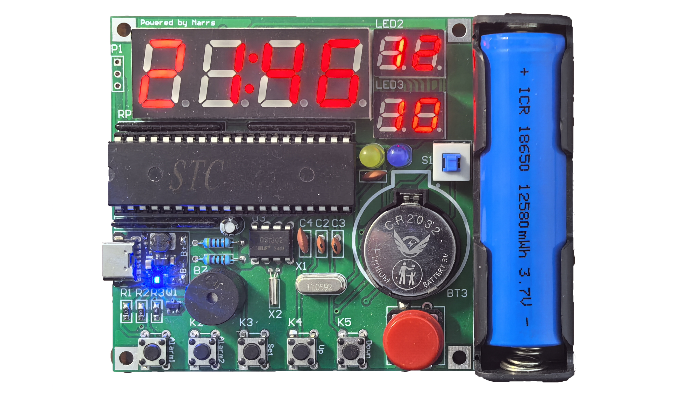

# BoomClock
该系统是51单片机与DS1302的简单应用，走时精准，外观简洁。  
  
  
  
## 应用场景  
用于桌面小摆件、DIY作品等。
## 产品概述  
1. 走时准确，制作简单；  
2. 可以设置2个闹钟；  
3. 断电走时；  
4. 自动计算闰年、大小月。  
## 产品参数
1. Type-C 供电（5v）  
2. 纽扣电池供电（3v）  
3. 18650电池供电（3.7v）  
## 使用说明
1. Alarm1：短按打开/关闭闹钟1；长按设置闹钟1的时间；  
2. Alarm2：短按打开/关闭闹钟2；长按设置闹钟2的时间；  
3. Set：短按显示年份；长按设置时间、日期；进入设置模式后短按跳转到下一位；  
4. Up：日期/时间增加；  
5. Down：日期/时间减少；  
6. Boom：短按10s倒计时；长按切换亮度。
